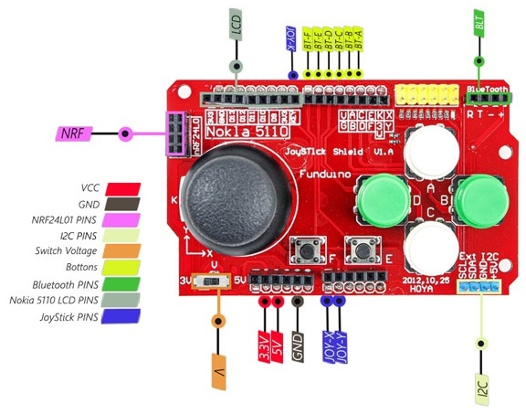

# LED Matrix Game

Este repositório contém o código básico de um projeto com foco em ensino de programação com Arduino.

A proposta é criar um pequeno e simples jogo utilizando Arduino e o módulo de 4 matrizes de LED e a shield JoyStick.

O módulo usa o circuito integrado MAX7219 para realizar o controle de cada matriz e com isso 
simplificar o controle da matriz por meio de uma comunicação serial via pinos digitais.

Neste exemplo usamos a biblioteca [LedControl](https://wayoda.github.io/LedControl/pages/software.html) 
para simplificar ainda mais o código.

## Montagem do projeto 

A imagem abaixo apresenta a montagem do projeto em protoboard. Para melhor visualização consulte o PDF [aqui](docs/led_matrix_schematic.pdf).

## Joystick Shield Fundiono

A [shield JoyStick](https://s.click.aliexpress.com/e/_DmHztbD) contém um joystick analógico e 4 botões. Vamos usar esses controles para movimentar os elementos no display.

## Vídeo do projeto

Para conhecer melhor o projeto acesse o vídeo no Youtube.

### Slides da apresentação

Aos que desejam os slides usados no vídeo, podem acessar aqui neste repositório na pasta **./docs** o arquivo [led_matrix_slides](docs/led_matrix_slides.pdf)