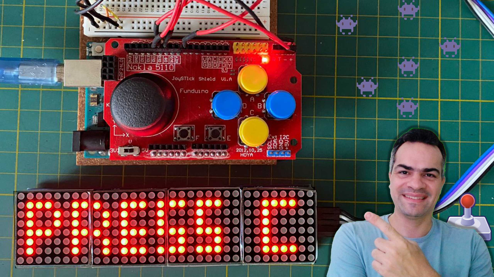
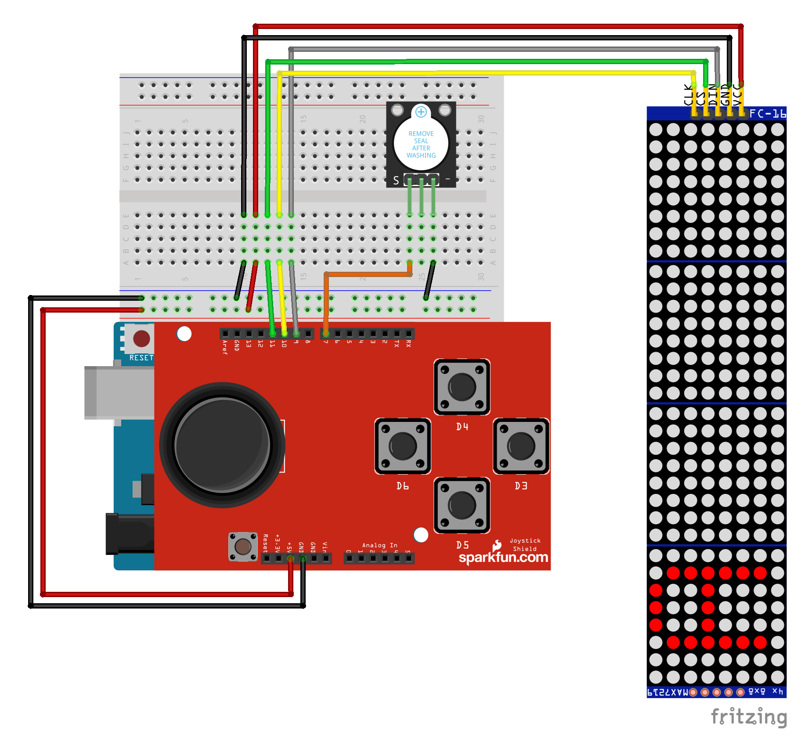
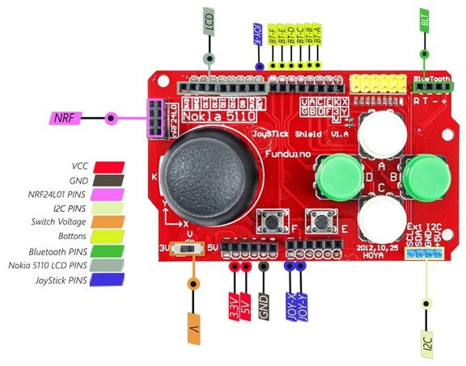

# LED Matrix Game

This repository contains the basic code for a project focused on teaching programming with Arduino.

The proposal is to create a small and simple game using Arduino and the 4 LED matrix module and the JoyStick shield.

The module uses the MAX7219 integrated circuit to control each matrix and thus simplify matrix control through serial communication via digital pins.

In this example, we use the [LedControl](https://wayoda.github.io/LedControl/pages/software.html) library to further simplify the code.

## Project Assembly

The image below shows the project assembly on a breadboard. For better visualization, consult the PDF [here](docs/led_matrix_schematic.pdf).

## Joystick Shield Functionality

The [JoyStick shield](https://s.click.aliexpress.com/e/_DmHztbD) contains an analog joystick and 4 buttons. We will use these controls to move the elements on the display.

## Project Video

To learn more about the project, watch the video on YouTube (brazilian portuguese audio only).

### Presentation Slides

For those who wish to access the slides used in the video, you can find them in this repository in the folder **./docs**. Here's the file: [led_matrix_slides](docs/led_matrix_slides.pdf)
